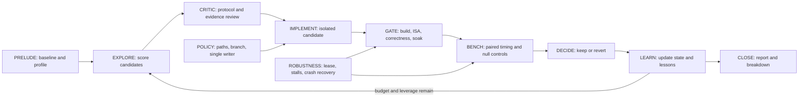

# Hyperloom-style agentic optimization for GEMM-RS

## Status

This branch currently contains the researched architecture and an
implementation plan. The GEMM-RS-specific orchestrator has **not** been
implemented or run yet.

## What Hyperloom is

[ROCm Hyperloom](https://github.com/AMD-AGI/Hyperloom) is an autonomous
optimization system for AMD GPU inference workloads. Its current runtime uses
a durable, multi-phase loop:

```text
PRELUDE -> FRAMEWORK_AGENT -> EXPLORE -> KERNEL_AGENT -> SWEEP -> CLOSE
```

The important idea is not a blind parameter sweep. Hyperloom:

1. establishes a reproducible baseline and profile;
2. builds and scores candidate optimizations;
3. asks specialist agents to research or implement candidates;
4. routes mutations through critic, correctness, and policy gates;
5. benchmarks candidates against the current validated best;
6. keeps wins, reverts failures, and records both as reusable knowledge;
7. re-scores the remaining search tree and repeats while budget and leverage
   remain;
8. writes durable session state and a machine-readable final breakdown.

Its orchestration agent keeps a persistent conversation across iterations.
Critic and robustness roles are reactive: the critic reviews risky proposals,
while robustness detects stalls, repeated attempts, crashes, and invalid
recovery behavior. Policy gates enforce phase ordering, path boundaries,
resource leases, and single-writer rules.

Upstream Hyperloom integrates TraceLens, Magpie, IntelliKit, and kernel
optimization backends such as GEAK. Its production workload contract is
primarily designed for vLLM and SGLang model serving.

## Why GEMM-RS needs a native adapter

GEMM-RS is not a model-serving workload. It is a standalone distributed HIP
megakernel with:

- one process driving eight MI300X GPUs in the development harness;
- a separate official evaluator protocol;
- peer-memory publication, acquire, and epoch-lifetime invariants;
- a mandatory build, ISA, correctness, negative-control, soak, and timing
  ladder;
- allocation-order and arm-pairing biases that require experiment-local null
  controls;
- a single shared GPU node and a strict one-job lease;
- Windows-to-remote-node synchronization through repository-owned wrappers.

Invoking upstream Hyperloom unchanged would force these constraints into
vLLM/SGLang concepts and would weaken the existing evidence gates. The proposed
system therefore adopts Hyperloom's orchestration methodology while treating
the current GEMM-RS harness as the benchmark and validation authority.

## Proposed GEMM-RS loop



### PRELUDE

- Record the source revision, kernel fingerprint, hardware, clocks, harness
  protocol, current winner, rank-1/reference denominators, and noise floors.
- Load the latest attribution and counter evidence, refreshing it when its
  fingerprint does not match the current binary.
- Seed the search tree from measured bottlenecks rather than generic GPU
  optimization advice.

### EXPLORE

Score candidates using:

- expected geometric-mean gain;
- which scored shapes the mechanism can affect;
- evidence confidence and novelty;
- implementation and GPU-time cost;
- protocol and correctness risk;
- interaction with already-landed changes.

After every result, update the scores and prune repeated failures with the same
mechanism fingerprint.

### CRITIC

Before mutation, review:

- whether the hypothesis follows from current measurements;
- whether the experiment isolates one mechanism;
- memory ordering, publication, acquire, and epoch lifetime for protocol
  changes;
- benchmark pairing, rotations, allocation order, null twins, and statistic
  choice;
- exact owned and forbidden paths.

### IMPLEMENT

Use a persistent Python Cursor SDK orchestration agent and focused,
short-lived roles:

- implementer;
- profiler;
- protocol reviewer;
- benchmark reviewer;
- critic;
- robustness monitor.

Only one role may own kernel files at a time. Candidate work should be isolated
until the coordinator deliberately integrates it.

### GATE and BENCH

Reuse the existing GEMM-RS machinery:

- `distributed-kernels/gemm_rs/overnight/tools/push_scoped.ps1`;
- `distributed-kernels/gemm_rs/overnight/tools/gpu_lease.sh`;
- `distributed-kernels/gemm_rs/overnight/tools/gate_ladder.sh`;
- `distributed-kernels/gemm_rs/overnight/tools/reattribute.sh`;
- evaluator, reference, and frozen rank-1 runners.

A candidate cannot reach timing until build, ISA/resources, all correctness
shapes at both tolerances, negative controls, and soak pass. Changes affecting
publication ordering also require M9 stale-slot validation.

Timing must use same-run paired arms, reversed construction order, shuffled
execution order, and the union of identically configured pairs as the null
distribution. Hyperloom's generic fixed speedup threshold is not suitable for
this node.

### DECIDE and LEARN

KEEP only when the candidate:

- passes every applicable correctness and protocol gate;
- is distinguished from the experiment-local noise floor;
- improves the intended metric without regressing protected shapes or the
  evaluator contract;
- has reproducible source, binary, ISA, and benchmark fingerprints.

Otherwise revert it and retain the negative result. Every attempt updates the
append-only lessons ledger so future sessions do not repeat closed axes.

## Durable session contract

The planned runtime directory is:

```text
distributed-kernels/gemm_rs/overnight/agentic/
  cli.py
  coordinator.py
  state.py
  policy.py
  runners.py
  agents.py
  report.py
  config.gemm_rs.json
  requirements.txt
  sessions/<session-id>/
```

Each session should contain:

- `manifest.json`: immutable workload, hardware, objective, budget, and source
  identity;
- `state.json`: atomic current phase, current best, candidate stack,
  orchestration memory, and pending operation;
- `events.jsonl`: append-only decisions and state transitions;
- `runs/<action>/<task-id>/`: prompts, patches, logs, fingerprints, and
  measurements;
- `reports/final.md`: operator-facing result;
- `session_breakdown.json`: versioned machine-readable baseline, attempts,
  adopted optimizations, validation, stop reason, and artifact paths.

Resume must reconstruct the orchestration conversation from compacted memory
plus authoritative state, not replay an unbounded transcript. Long GPU or build
operations need durable sentinels so recovery can distinguish a running job,
completed job, terminal protocol failure, and safe retry.

## Policy requirements

The coordinator must enforce:

- the GEMM-RS ownership charter and forbidden `distributed-kernels/fused_moe/**`
  and `.node/**` paths;
- no edits to the frozen rank-1 submission;
- scoped synchronization to the MI300X node;
- one kernel writer and one GPU job;
- pinned clocks before timing;
- liveness-aware KFD checks that ignore `exit_mm` corpses;
- graceful GPU-process termination rather than `SIGKILL`;
- no automatic KEEP, commit, or push before the complete experiment verdict.

## Implementation milestones

1. Create the durable CLI, state machine, candidate scoring, and report schema.
2. Integrate Cursor SDK orchestration and role-specific prompts.
3. Implement path, branch, lease, protocol, and statistical policy gates.
4. Wrap the existing remote harness and repair stale-PID checks in the gate
   ladder.
5. Unit-test state transitions, policy denials, scoring, result parsing,
   KEEP/REVERT decisions, crash recovery, and idempotent close.
6. Run a synthetic no-GPU session, then a baseline-only live session.
7. Run one bounded real optimization cycle against the current top-ranked
   bottleneck.

## Current evidence that should seed the first session

The latest GEMM-RS records show that the important optimization targets are not
generic HBM bandwidth tuning:

- shapes 5 and 6 carry the remaining gap;
- the GEMM mainloop's non-MFMA latency/schedule time is the largest device-side
  pool;
- the official evaluator exposes a significant arm-dependent per-call cost;
- release granularity remains shape-dependent;
- several intuitive axes are already closed by measurements and must not be
  re-run without invalidating evidence.

The authoritative starting points are:

- `distributed-kernels/gemm_rs/overnight/HANDOFF.md`;
- `distributed-kernels/gemm_rs/overnight/aug11/STATUS.md`;
- `distributed-kernels/gemm_rs/overnight/aug11/exp_20_attribution/`;
- `distributed-kernels/gemm_rs/overnight/aug11/exp_27_mainloop/`;
- `distributed-kernels/gemm_rs/overnight/experiments/LESSONS.md`.

